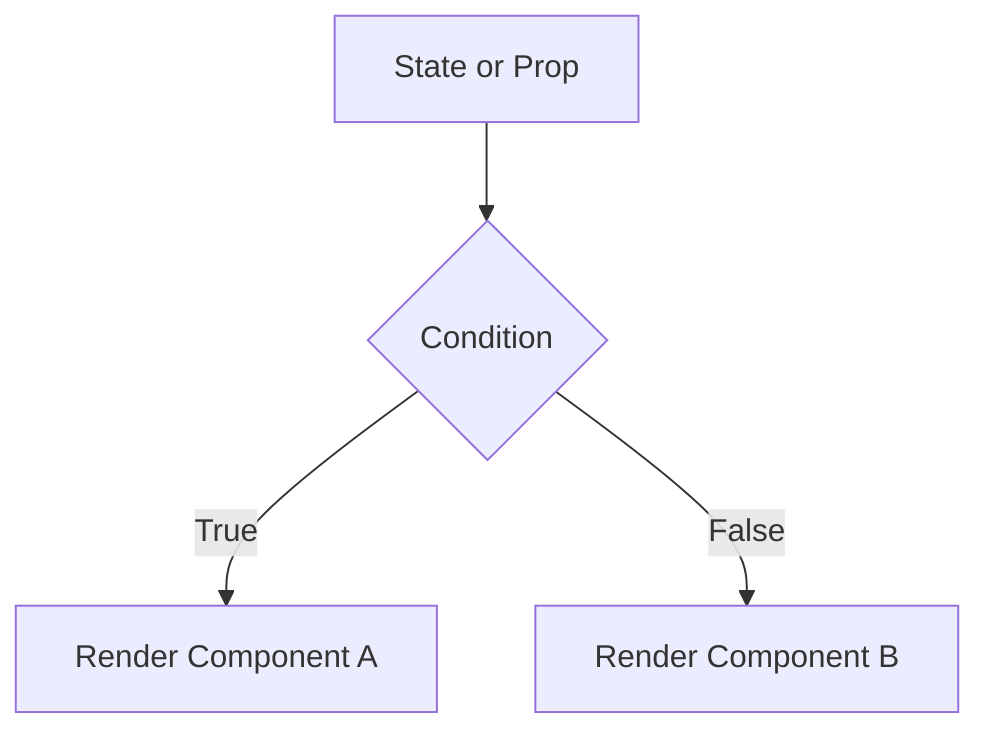

# **Conditional Rendering in React**  

## **Definition**  
Conditional rendering in React means displaying different UI elements based on certain conditions, such as user authentication, loading states, or feature toggles. It allows components to change dynamically based on state or props.

---

## **Techniques for Conditional Rendering**  

| Technique | Description | Example Use Case |
|-----------|------------|-----------------|
| **if Statement** | Uses JavaScript `if` statements inside functions to control rendering. | Show a message only if a user is logged in. |
| **Ternary Operator (`? :`)** | A compact way to conditionally render one of two elements. | Show a login button if not logged in, otherwise show logout. |
| **Logical AND (`&&`)** | Renders an element only if a condition is true. | Display a loading spinner only when `isLoading` is `true`. |
| **Switch Statement** | Uses `switch` to render different elements based on a variable's value. | Render different UI elements based on user roles. |
| **Immediately Invoked Function Expressions (IIFE)** | Uses a function inside JSX to return UI conditionally. | Handle complex logic directly in JSX. |

---

## **1. Using if Statements**  
```jsx
function WelcomeMessage({ isLoggedIn }) {
  if (isLoggedIn) {
    return <h1>Welcome Back!</h1>;
  } else {
    return <h1>Please Log In</h1>;
  }
}
```
✅ **Pros**: Simple and readable.  
❌ **Cons**: Cannot be used directly inside JSX.  

---

## **2. Using the Ternary Operator (`? :`)**  
```jsx
function AuthButton({ isLoggedIn }) {
  return (
    <button>{isLoggedIn ? "Logout" : "Login"}</button>
  );
}
```
✅ **Pros**: Concise and usable inside JSX.  
❌ **Cons**: Becomes hard to read if nested.  

---

## **3. Using Logical AND (`&&`)**  
```jsx
function Notification({ hasNotifications }) {
  return (
    <div>
      <h1>Dashboard</h1>
      {hasNotifications && <p>You have new notifications!</p>}
    </div>
  );
}
```
✅ **Pros**: Simple and clean for single-condition rendering.  
❌ **Cons**: Does not work if `hasNotifications` is `0`, as `0` is falsy in JavaScript.  

---

## **4. Using Switch Statements**  
```jsx
function UserRole({ role }) {
  switch (role) {
    case "admin":
      return <h1>Admin Dashboard</h1>;
    case "user":
      return <h1>User Dashboard</h1>;
    default:
      return <h1>Guest View</h1>;
  }
}
```
✅ **Pros**: Best for multiple conditions.  
❌ **Cons**: More verbose than ternary or logical AND.  

---

## **5. Using IIFE (Immediately Invoked Function Expressions)**  
```jsx
function StatusMessage({ status }) {
  return (
    <div>
      {(() => {
        if (status === "loading") return <p>Loading...</p>;
        if (status === "error") return <p>Error occurred!</p>;
        return <p>Success!</p>;
      })()}
    </div>
  );
}
```
✅ **Pros**: Allows complex logic inside JSX.  
❌ **Cons**: Less readable for beginners.  

---

## **Diagram: Conditional Rendering Flow**  


---

## **Key Takeaways**  
- Use `if` statements for simple conditions outside JSX.  
- Use the ternary operator (`? :`) for inline conditional rendering.  
- Use logical AND (`&&`) for rendering elements based on a single condition.  
- Use `switch` when dealing with multiple conditions.  
- Use IIFE for complex conditions inside JSX.