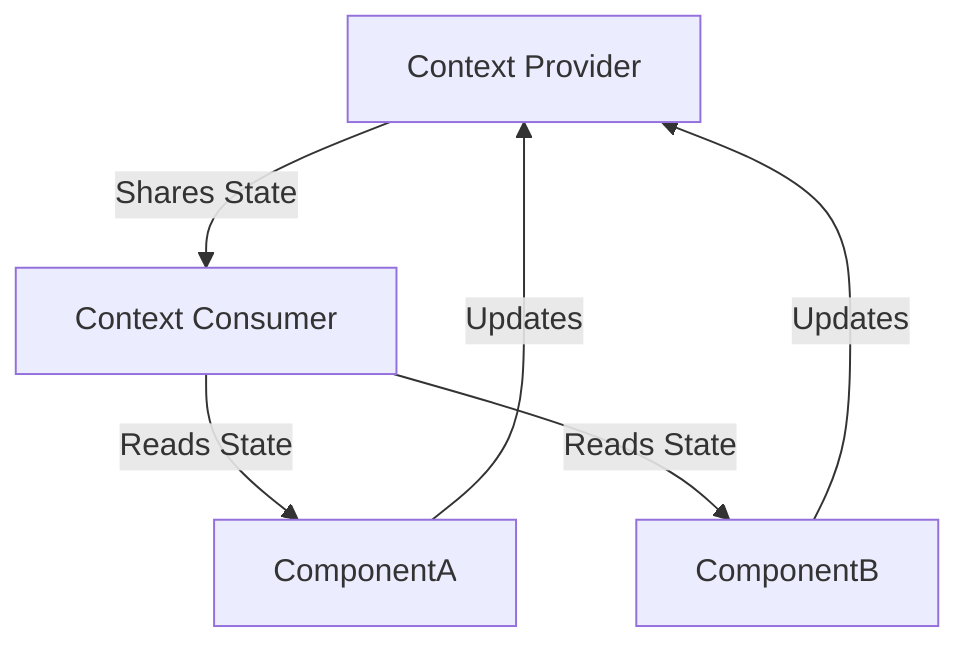

## **Context API in React**  

Context API is a built-in state management solution in React that enables data sharing between components without prop drilling. It is efficient for managing global state in small to medium applications.  

---

### **Key Concepts of Context API**  

| **Concept**       | **Description** |  
|------------------|----------------|  
| **Context Provider** | A component that stores the state and provides it to child components. |  
| **Context Consumer** | Any component that accesses and uses the provided state. |  
| **useContext Hook** | A React Hook that allows components to consume context without using the Consumer component. |  

---

### **Creating and Using Context API**  

#### **1. Create a Context**  
```jsx
import { createContext } from "react";

const MyContext = createContext(); // Create a context object
export default MyContext;
```  

#### **2. Create a Provider Component**  
```jsx
import { useState } from "react";
import MyContext from "./MyContext";

const MyProvider = ({ children }) => {
  const [data, setData] = useState("Hello Context!");

  return (
    <MyContext.Provider value={{ data, setData }}>
      {children}
    </MyContext.Provider>
  );
};

export default MyProvider;
```  

#### **3. Consume Context in a Component**  

**Using `useContext` Hook (Recommended)**  
```jsx
import { useContext } from "react";
import MyContext from "./MyContext";

const MyComponent = () => {
  const { data } = useContext(MyContext);
  return <h1>{data}</h1>;
};
```  

**Using Consumer Component (Alternative)**  
```jsx
import MyContext from "./MyContext";

const MyComponent = () => (
  <MyContext.Consumer>
    {({ data }) => <h1>{data}</h1>}
  </MyContext.Consumer>
);
```  

#### **4. Wrap Application with Provider**  
```jsx
import MyProvider from "./MyProvider";
import MyComponent from "./MyComponent";

function App() {
  return (
    <MyProvider>
      <MyComponent />
    </MyProvider>
  );
}

export default App;
```  

---

### **Advantages of Context API**  

✅ **Avoids Prop Drilling** – Eliminates passing props manually through multiple levels.  
✅ **Built-in Feature** – No need for third-party libraries.  
✅ **Simplifies State Sharing** – Easy to use for global state management.  
✅ **Works Well with Hooks** – `useContext` provides a simple way to consume context.  

---

### **Limitations of Context API**  

⚠ **Causes Unnecessary Re-renders** – Any change in context triggers a re-render for all consuming components.  
⚠ **Not Ideal for Large Applications** – For complex state management, Redux or Zustand may be better.  
⚠ **Performance Issues** – Requires optimization techniques like context splitting or memoization (`useMemo`).  

---

### **Optimizing Context API**  

| **Optimization** | **Solution** |  
|----------------|--------------|  
| **Reduce Re-renders** | Split context into multiple smaller contexts. |  
| **Avoid Large Context Objects** | Pass only necessary values instead of the entire state. |  
| **Use `useMemo`** | Memoize context values to prevent unnecessary updates. |  
| **Combine with Reducers** | Use `useReducer` inside the provider for complex state logic. |  

Example of using `useMemo` for optimization:  
```jsx
const value = useMemo(() => ({ data, setData }), [data]);
<MyContext.Provider value={value}>{children}</MyContext.Provider>
```  

---

### **Diagram: Context API Flow**  



---

### **When to Use Context API**  

- **When multiple components need access to the same data** (e.g., authentication, themes, user preferences).  
- **When prop drilling becomes unmanageable** due to deeply nested components.  
- **For small to medium-sized applications** where Redux or other state management tools may be unnecessary.  

For **large-scale applications**, use Context API in combination with `useReducer`, or opt for Redux, Zustand, or Recoil.