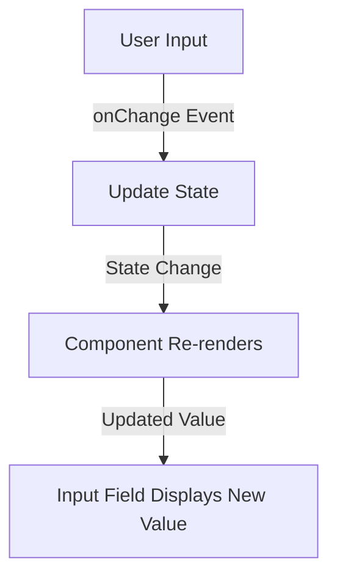

# **Controlled Components in React**  

## **Definition**  
Controlled components in React are form elements whose values are managed by the component’s state instead of the DOM. This ensures predictable behavior and full control over user input.  

---

## **How Controlled Components Work**  

- The component's state stores the form value.  
- The `onChange` event updates the state when the user types.  
- The input value is always controlled by React.  

---

## **Basic Example**  

```jsx
import { useState } from "react";

function ControlledInput() {
  const [text, setText] = useState("");

  function handleChange(event) {
    setText(event.target.value);
  }

  return (
    <input type="text" value={text} onChange={handleChange} />
  );
}
```
✅ **Pros**: Predictable state, easy validation, and controlled behavior.  
❌ **Cons**: Requires state management for each input.  

---

## **Multiple Controlled Inputs**  

```jsx
import { useState } from "react";

function MultiInputForm() {
  const [formData, setFormData] = useState({ name: "", email: "" });

  function handleChange(event) {
    setFormData({ ...formData, [event.target.name]: event.target.value });
  }

  return (
    <form>
      <input type="text" name="name" value={formData.name} onChange={handleChange} placeholder="Name" />
      <input type="email" name="email" value={formData.email} onChange={handleChange} placeholder="Email" />
    </form>
  );
}
```
✅ **Pros**: Manages multiple inputs efficiently.  
❌ **Cons**: More complex for large forms.  

---

## **Handling Select, Checkbox, and Radio Inputs**  

### **Select Dropdown**  
```jsx
function SelectForm() {
  const [option, setOption] = useState("apple");

  return (
    <select value={option} onChange={(e) => setOption(e.target.value)}>
      <option value="apple">Apple</option>
      <option value="banana">Banana</option>
      <option value="cherry">Cherry</option>
    </select>
  );
}
```

### **Checkbox Input**  
```jsx
function CheckboxForm() {
  const [checked, setChecked] = useState(false);

  return (
    <label>
      <input type="checkbox" checked={checked} onChange={() => setChecked(!checked)} />
      Accept Terms
    </label>
  );
}
```

### **Radio Buttons**  
```jsx
function RadioForm() {
  const [selected, setSelected] = useState("male");

  return (
    <>
      <label>
        <input type="radio" value="male" checked={selected === "male"} onChange={(e) => setSelected(e.target.value)} />
        Male
      </label>
      <label>
        <input type="radio" value="female" checked={selected === "female"} onChange={(e) => setSelected(e.target.value)} />
        Female
      </label>
    </>
  );
}
```

---

## **Diagram: Controlled Component Flow**  



---

## **Key Takeaways**  
- The state fully controls the form elements.  
- React updates state via `onChange`.  
- Prevents direct DOM manipulation.  
- Useful for validation and real-time UI updates.