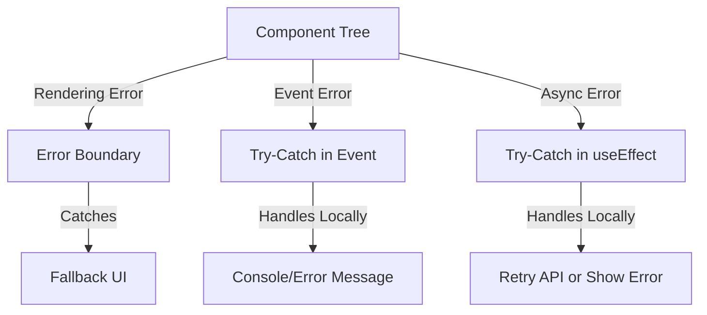

# **Error Handling in React**

## **Definition**
Error handling in React ensures that unexpected runtime errors do not crash the entire application. React provides different ways to **detect, catch, and gracefully handle** errors to improve user experience and debugging.

---

## **Types of Errors in React**
| **Type**             | **Description**                                  | **Example** |
|----------------------|------------------------------------------------|------------|
| **Rendering Errors** | Occur during component rendering.              | `return props.data.name;` (if `props.data` is `undefined`). |
| **Lifecycle Errors** | Errors in lifecycle methods like `componentDidMount`. | API call failure in `useEffect`. |
| **Event Handling Errors** | Errors inside event listeners. | `onClick={() => someUndefinedFunction()}`. |
| **Async Errors**     | Errors in async functions like API calls.       | Fetch failure due to network issues. |

---

## **Error Boundaries (Class Components)**
Error Boundaries **catch rendering errors in the component tree** and prevent them from crashing the entire app.

### **Implementation**
```jsx
class ErrorBoundary extends React.Component {
  constructor(props) {
    super(props);
    this.state = { hasError: false };
  }

  static getDerivedStateFromError(error) {
    return { hasError: true };
  }

  componentDidCatch(error, info) {
    console.error("Error caught:", error, info);
  }

  render() {
    if (this.state.hasError) {
      return <h2>Something went wrong.</h2>;
    }
    return this.props.children;
  }
}

// Usage
<ErrorBoundary>
  <SomeComponent />
</ErrorBoundary>;
```

✅ **Catches errors in children components** but **not in event handlers or async code**.  

---

## **Handling Errors in Functional Components**
React **does not support error boundaries in functional components**, but you can handle errors using:

### **1. Try-Catch in Event Handlers**
```jsx
const handleClick = () => {
  try {
    someUndefinedFunction();
  } catch (error) {
    console.error("Caught an error:", error);
  }
};
<button onClick={handleClick}>Click Me</button>;
```

✅ **Handles event-related errors locally.**  
❌ **Does not catch rendering errors.**  

---

### **2. Using `useEffect` for Async Errors**
```jsx
useEffect(() => {
  const fetchData = async () => {
    try {
      const response = await fetch("https://api.example.com/data");
      const data = await response.json();
    } catch (error) {
      console.error("Error fetching data:", error);
    }
  };
  fetchData();
}, []);
```
✅ **Handles async API errors.**  

---

### **3. Error Boundaries with Functional Components (Wrapper)**
Wrap functional components inside an error boundary:
```jsx
<ErrorBoundary>
  <MyFunctionalComponent />
</ErrorBoundary>;
```

✅ **Catches errors from the entire subtree.**  

---

## **Handling Fallback UI Gracefully**
Instead of displaying an error message, you can **provide a fallback UI**.
```jsx
if (error) {
  return <h2>Oops! Something went wrong.</h2>;
}
```

---

## **Comparison of Error Handling Methods**
| **Method**                | **Handles Render Errors?** | **Handles Event Errors?** | **Handles Async Errors?** |
|---------------------------|---------------------------|---------------------------|---------------------------|
| **Error Boundaries**      | ✅ Yes                     | ❌ No                      | ❌ No                      |
| **Try-Catch in Events**   | ❌ No                      | ✅ Yes                     | ❌ No                      |
| **Try-Catch in `useEffect`** | ❌ No                      | ❌ No                      | ✅ Yes                     |

---

## **Diagram: Error Flow in React**


---

## **Best Practices**
✅ Use **Error Boundaries** for **critical components** (e.g., Dashboard, Forms).  
✅ Wrap API calls inside `try-catch` to handle **network failures**.  
✅ Log errors using **console/error monitoring tools** like **Sentry**.  
✅ Always **provide fallback UI** instead of crashing the app.  

---

## **Conclusion**
Error handling in React ensures a **stable, user-friendly experience**. **Error Boundaries** catch rendering errors, while **try-catch** handles event and async failures. Using both effectively improves reliability and debugging. 