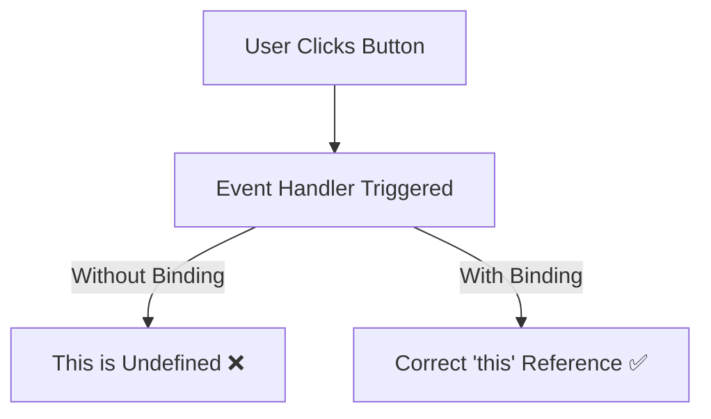

# **Event Binding in React**  

## **Definition**  
Event binding in React refers to **attaching event handlers** to elements so that they execute specific functions when an event occurs. Binding ensures that event handlers maintain the correct `this` reference, especially in class components.  

---

## **Why Event Binding is Necessary?**  
- **Ensures Correct `this` Context**: Class methods do not automatically bind `this` to the component.  
- **Prevents Errors**: Without binding, `this` inside an event handler may be `undefined`.  
- **Allows Passing Arguments**: Binding helps pass parameters to event handlers.  

---

## **Methods of Event Binding in React**  

### **1. Binding in the Constructor (Recommended for Class Components)**  
- Ensures the method is bound once and reused efficiently.  
```jsx
class App extends React.Component {
  constructor(props) {
    super(props);
    this.handleClick = this.handleClick.bind(this);
  }

  handleClick() {
    console.log("Button clicked!", this);
  }

  render() {
    return <button onClick={this.handleClick}>Click Me</button>;
  }
}
```
✅ **Best for performance** as the function is bound once in the constructor.  

---

### **2. Using Arrow Functions in Class Methods**  
- Arrow functions automatically bind `this` to the class.  
```jsx
class App extends React.Component {
  handleClick = () => {
    console.log("Button clicked!", this);
  };

  render() {
    return <button onClick={this.handleClick}>Click Me</button>;
  }
}
```
✅ Avoids explicit binding but may create a new function for each instance.  

---

### **3. Using Arrow Functions in JSX (Not Recommended for Performance)**  
- Creates a new function every render, which may impact performance.  
```jsx
class App extends React.Component {
  handleClick() {
    console.log("Button clicked!", this);
  }

  render() {
    return <button onClick={() => this.handleClick()}>Click Me</button>;
  }
}
```
⚠ **Avoid when possible** because a new function is created on each render.  

---

### **4. Binding with `.bind()` in JSX (Not Recommended for Performance)**  
- Similar to the arrow function in JSX, it creates a new function every render.  
```jsx
class App extends React.Component {
  handleClick() {
    console.log("Button clicked!", this);
  }

  render() {
    return <button onClick={this.handleClick.bind(this)}>Click Me</button>;
  }
}
```
⚠ **Avoid this approach** as it reduces performance by creating a new function on each render.  

---

## **Event Binding in Functional Components**  
- Functional components use React **Hooks** (`useState`, `useEffect`) and don’t need explicit binding.  
```jsx
function App() {
  function handleClick() {
    console.log("Button clicked!");
  }

  return <button onClick={handleClick}>Click Me</button>;
}
```
✅ No need for `this`, so event binding issues do not exist.  

---

## **Passing Arguments in Event Handlers**  
You can pass arguments using arrow functions or `bind()`.  

### **Passing Arguments Using Arrow Functions**  
```jsx
class App extends React.Component {
  handleClick = (message) => {
    console.log(message);
  };

  render() {
    return <button onClick={() => this.handleClick("Hello!")}>Click Me</button>;
  }
}
```
✅ Creates a new function but works well for simple cases.  

---

### **Passing Arguments Using `.bind()`**  
```jsx
class App extends React.Component {
  handleClick(message) {
    console.log(message);
  }

  render() {
    return <button onClick={this.handleClick.bind(this, "Hello!")}>Click Me</button>;
  }
}
```
⚠ Not recommended due to performance impact from multiple function creations.  

---

## **Diagram: Event Binding Flow in React**  


---

## **Key Takeaways**  
- Class components require **binding** to maintain the correct `this` reference.  
- **Best Approach**: Bind in the constructor or use class arrow functions.  
- **Avoid inline binding** (`.bind()` in JSX or arrow functions in JSX) for performance reasons.  
- Functional components do **not** require event binding due to the absence of `this`.