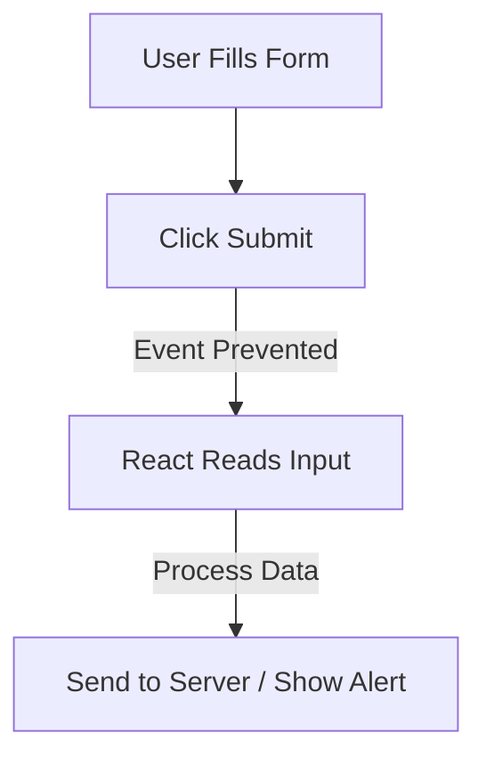

# **Handling Form Submission in React**  

## **Definition**  
Handling form submission in React involves collecting user input, preventing default form behavior, and processing the data using event handlers.  

---

## **Basic Steps for Handling Form Submission**  
1. Prevent default form submission using `event.preventDefault()`.  
2. Read form data from state (controlled) or `ref` (uncontrolled).  
3. Process or send data to an API or function.  

---

## **Example: Controlled Form Submission**  

```jsx
import { useState } from "react";

function ControlledForm() {
  const [name, setName] = useState("");

  function handleSubmit(event) {
    event.preventDefault();
    alert("Submitted Name: " + name);
  }

  return (
    <form onSubmit={handleSubmit}>
      <input 
        type="text" 
        value={name} 
        onChange={(e) => setName(e.target.value)} 
      />
      <button type="submit">Submit</button>
    </form>
  );
}
```
✅ **Pros**: Predictable, React fully controls input.  
❌ **Cons**: Requires `useState` for every input field.  

---

## **Example: Uncontrolled Form Submission**  

```jsx
import { useRef } from "react";

function UncontrolledForm() {
  const inputRef = useRef();

  function handleSubmit(event) {
    event.preventDefault();
    alert("Submitted Name: " + inputRef.current.value);
  }

  return (
    <form onSubmit={handleSubmit}>
      <input type="text" ref={inputRef} />
      <button type="submit">Submit</button>
    </form>
  );
}
```
✅ **Pros**: Simpler for non-interactive forms.  
❌ **Cons**: Harder to track input changes.  

---

## **Handling Multiple Inputs**  

```jsx
function MultiInputForm() {
  const [formData, setFormData] = useState({ name: "", email: "" });

  function handleChange(event) {
    setFormData({ ...formData, [event.target.name]: event.target.value });
  }

  function handleSubmit(event) {
    event.preventDefault();
    alert(`Name: ${formData.name}, Email: ${formData.email}`);
  }

  return (
    <form onSubmit={handleSubmit}>
      <input name="name" value={formData.name} onChange={handleChange} />
      <input name="email" value={formData.email} onChange={handleChange} />
      <button type="submit">Submit</button>
    </form>
  );
}
```

---

## **Diagram: Form Submission Flow**  



---

## **Key Takeaways**  
- Use `preventDefault()` to stop page reloads.  
- Controlled forms store values in `useState`.  
- Uncontrolled forms access values using `ref`.  
- Handle multiple inputs by updating state dynamically.