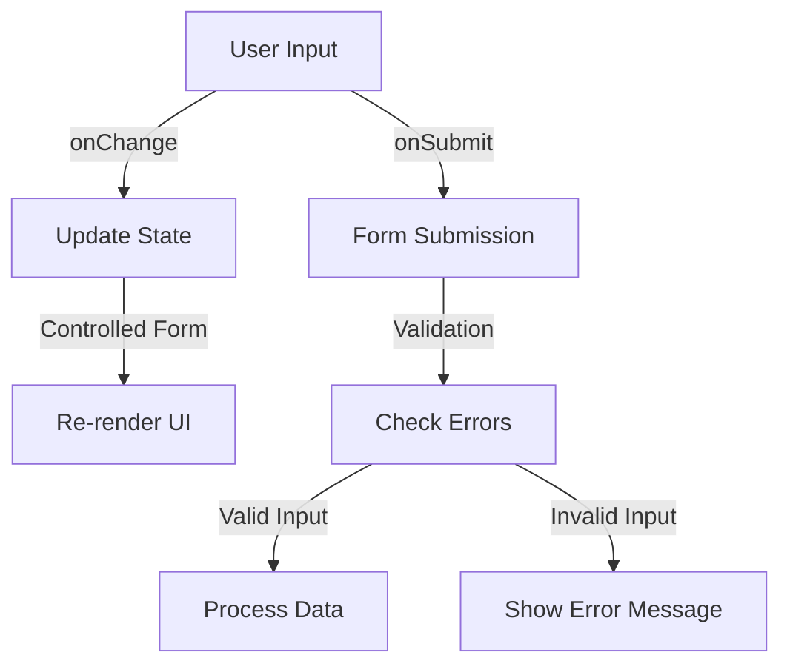

# **Forms in React**  

## **Definition**  
Forms in React are used to collect user input and handle state updates efficiently. Unlike traditional HTML forms, React controls form elements using component state.

---

## **Controlled vs Uncontrolled Components**  

| Type           | Definition | Example |
|---------------|------------|---------|
| **Controlled Component** | Form elements are controlled by React state. | Uses `useState` to track input values. |
| **Uncontrolled Component** | Form elements are controlled by the DOM. | Uses `useRef` to access input values. |

---

## **Controlled Components**  

React manages form elements by storing their values in state.  

```jsx
import { useState } from "react";

function ControlledForm() {
  const [inputValue, setInputValue] = useState("");

  function handleChange(event) {
    setInputValue(event.target.value);
  }

  function handleSubmit(event) {
    event.preventDefault();
    alert(`Submitted: ${inputValue}`);
  }

  return (
    <form onSubmit={handleSubmit}>
      <input type="text" value={inputValue} onChange={handleChange} />
      <button type="submit">Submit</button>
    </form>
  );
}
```
✅ **Pros**: Fully controlled by React, allowing validation and real-time updates.  
❌ **Cons**: Can be complex for large forms.  

---

## **Uncontrolled Components**  

React does not track state; instead, `useRef` is used to access values.  

```jsx
import { useRef } from "react";

function UncontrolledForm() {
  const inputRef = useRef(null);

  function handleSubmit(event) {
    event.preventDefault();
    alert(`Submitted: ${inputRef.current.value}`);
  }

  return (
    <form onSubmit={handleSubmit}>
      <input type="text" ref={inputRef} />
      <button type="submit">Submit</button>
    </form>
  );
}
```
✅ **Pros**: Simpler for basic forms.  
❌ **Cons**: Harder to validate and update dynamically.  

---

## **Handling Multiple Inputs**  

```jsx
import { useState } from "react";

function MultiInputForm() {
  const [formData, setFormData] = useState({ name: "", email: "" });

  function handleChange(event) {
    setFormData({ ...formData, [event.target.name]: event.target.value });
  }

  function handleSubmit(event) {
    event.preventDefault();
    alert(`Name: ${formData.name}, Email: ${formData.email}`);
  }

  return (
    <form onSubmit={handleSubmit}>
      <input type="text" name="name" value={formData.name} onChange={handleChange} placeholder="Name" />
      <input type="email" name="email" value={formData.email} onChange={handleChange} placeholder="Email" />
      <button type="submit">Submit</button>
    </form>
  );
}
```
✅ **Pros**: Efficiently handles multiple inputs.  
❌ **Cons**: Can become complex with many fields.  

---

## **Handling Select, Checkbox, and Radio Inputs**  

### **Select Dropdown**  
```jsx
function SelectForm() {
  const [option, setOption] = useState("apple");

  return (
    <select value={option} onChange={(e) => setOption(e.target.value)}>
      <option value="apple">Apple</option>
      <option value="banana">Banana</option>
      <option value="cherry">Cherry</option>
    </select>
  );
}
```

### **Checkbox Input**  
```jsx
function CheckboxForm() {
  const [checked, setChecked] = useState(false);

  return (
    <label>
      <input type="checkbox" checked={checked} onChange={() => setChecked(!checked)} />
      Accept Terms
    </label>
  );
}
```

### **Radio Buttons**  
```jsx
function RadioForm() {
  const [selected, setSelected] = useState("male");

  return (
    <>
      <label>
        <input type="radio" value="male" checked={selected === "male"} onChange={(e) => setSelected(e.target.value)} />
        Male
      </label>
      <label>
        <input type="radio" value="female" checked={selected === "female"} onChange={(e) => setSelected(e.target.value)} />
        Female
      </label>
    </>
  );
}
```

---

## **Form Validation**  

```jsx
function FormValidation() {
  const [email, setEmail] = useState("");
  const [error, setError] = useState("");

  function handleSubmit(event) {
    event.preventDefault();
    if (!email.includes("@")) {
      setError("Invalid email address");
    } else {
      setError("");
      alert("Form submitted!");
    }
  }

  return (
    <form onSubmit={handleSubmit}>
      <input type="email" value={email} onChange={(e) => setEmail(e.target.value)} placeholder="Email" />
      {error && <p style={{ color: "red" }}>{error}</p>}
      <button type="submit">Submit</button>
    </form>
  );
}
```
✅ **Pros**: Ensures valid user input.  
❌ **Cons**: Requires additional logic.  

---

## **Diagram: Form Handling in React**  



---

## **Key Takeaways**  
- **Controlled Components**: Use `useState` to manage form inputs.  
- **Uncontrolled Components**: Use `useRef` to access values directly.  
- **Multiple Inputs**: Store all values in a single state object.  
- **Validation**: Prevents incorrect user input.  
- **Event Handling**: `onChange` updates state, `onSubmit` prevents default behavior.  