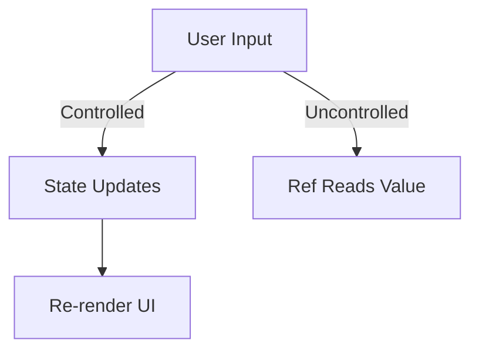

# **Handling User Input in React**  

## **Definition**  
Handling user input in React refers to **capturing user interactions** (such as typing in a form field, clicking a button, or selecting an option) and updating the component state accordingly.  

---

## **Key Aspects of Handling User Input**  
- **Controlled Components**: React controls form elements using state.  
- **Uncontrolled Components**: Use `ref` instead of state for direct access.  
- **Event Handling**: Capturing input events like `onChange`, `onClick`, `onSubmit`, etc.  

---

## **1. Controlled Components (Recommended)**  
A **controlled component** maintains form values in the component's `state`, ensuring React manages the input's value.  

### **Example: Handling Text Input**  
```jsx
import React, { useState } from "react";

function TextInput() {
  const [inputValue, setInputValue] = useState("");

  const handleChange = (event) => {
    setInputValue(event.target.value);
  };

  return (
    <div>
      <input type="text" value={inputValue} onChange={handleChange} />
      <p>Typed Value: {inputValue}</p>
    </div>
  );
}
```
✅ React controls the input using `useState`, ensuring the UI updates when the state changes.  

---

### **Example: Handling Checkbox Input**  
```jsx
function CheckboxInput() {
  const [isChecked, setIsChecked] = useState(false);

  const handleChange = () => {
    setIsChecked(!isChecked);
  };

  return (
    <div>
      <input type="checkbox" checked={isChecked} onChange={handleChange} />
      <p>{isChecked ? "Checked" : "Unchecked"}</p>
    </div>
  );
}
```
✅ React updates the checkbox state dynamically.  

---

## **2. Uncontrolled Components**  
An **uncontrolled component** allows the browser to manage the input state, with React accessing values via `useRef`.  

### **Example: Using `ref` to Access Input Value**  
```jsx
import React, { useRef } from "react";

function UncontrolledInput() {
  const inputRef = useRef(null);

  const handleSubmit = () => {
    alert(`Input Value: ${inputRef.current.value}`);
  };

  return (
    <div>
      <input type="text" ref={inputRef} />
      <button onClick={handleSubmit}>Submit</button>
    </div>
  );
}
```
✅ Useful when React does not need to control every keystroke, like accessing input only on form submission.  

---

## **3. Handling Form Submission**  
Use the `onSubmit` event to handle forms.  

### **Example: Submitting a Form**  
```jsx
function FormSubmit() {
  const [name, setName] = useState("");

  const handleSubmit = (event) => {
    event.preventDefault();
    alert(`Submitted Name: ${name}`);
  };

  return (
    <form onSubmit={handleSubmit}>
      <input type="text" value={name} onChange={(e) => setName(e.target.value)} />
      <button type="submit">Submit</button>
    </form>
  );
}
```
✅ Prevents default behavior and handles submission in React.  

---

## **4. Handling Select Dropdowns**  
```jsx
function SelectInput() {
  const [selected, setSelected] = useState("");

  return (
    <div>
      <select value={selected} onChange={(e) => setSelected(e.target.value)}>
        <option value="">Select</option>
        <option value="React">React</option>
        <option value="Vue">Vue</option>
        <option value="Angular">Angular</option>
      </select>
      <p>Selected: {selected}</p>
    </div>
  );
}
```
✅ React updates the state when a new option is selected.  

---

## **5. Handling Multiple Inputs in Forms**  
Use an object in `useState` for multiple form fields.  

```jsx
function MultiInputForm() {
  const [formData, setFormData] = useState({ name: "", email: "" });

  const handleChange = (event) => {
    setFormData({
      ...formData,
      [event.target.name]: event.target.value,
    });
  };

  return (
    <form>
      <input type="text" name="name" value={formData.name} onChange={handleChange} />
      <input type="email" name="email" value={formData.email} onChange={handleChange} />
      <p>Name: {formData.name}</p>
      <p>Email: {formData.email}</p>
    </form>
  );
}
```
✅ Efficiently manages multiple input fields with a single `handleChange` function.  

---

## **Diagram: Controlled vs. Uncontrolled Components**  


---

## **Key Takeaways**  
- **Controlled Components** use state to manage input values (recommended for most cases).  
- **Uncontrolled Components** use `ref` to access input values without state updates.  
- **Event Handling** (`onChange`, `onClick`, `onSubmit`) ensures proper data flow.  
- **Multiple Inputs** can be managed with an object in `useState`.