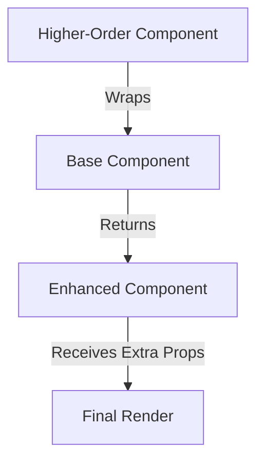

# **Higher-Order Components (HOC) in React**  

### **Definition**  
A **Higher-Order Component (HOC)** is a function that takes a component and returns a new component with additional functionality. It follows the principle of **component reusability** by wrapping existing components and extending their behavior without modifying them directly.

---

## **Key Characteristics**  

| **Feature**               | **Description** |
|---------------------------|----------------|
| **Pure Function**         | Takes a component as an argument and returns a new one. |
| **Code Reusability**      | Encapsulates common logic to be reused across multiple components. |
| **Separation of Concerns** | Keeps UI components clean and focused on presentation. |
| **Props Enhancement**      | Injects additional props into wrapped components. |

---

## **Syntax**  

A HOC is a function that wraps a component:

```jsx
const withExtraProp = (WrappedComponent) => {
  return (props) => <WrappedComponent extra="Hello" {...props} />;
};

const BaseComponent = ({ extra }) => <p>{extra}</p>;

const EnhancedComponent = withExtraProp(BaseComponent);
```

✅ **Reuses logic without modifying the original component.**  
✅ **Keeps components focused on their primary responsibility.**  

---

## **Use Cases**  

| **Use Case**            | **Description** |
|-------------------------|----------------|
| **Authentication**      | Restricts access based on user roles. |
| **Logging & Analytics** | Tracks component rendering for debugging. |
| **Fetching Data**       | Handles API calls and provides data as props. |
| **UI Enhancements**     | Adds styling, animations, or tooltips. |

---

## **Example 1: Authentication HOC**  

Restricts access to a component based on authentication status.  

```jsx
const withAuth = (WrappedComponent) => {
  return (props) => (props.isAuthenticated ? <WrappedComponent {...props} /> : <p>Access Denied</p>);
};

const Dashboard = () => <p>Welcome to Dashboard</p>;

const ProtectedDashboard = withAuth(Dashboard);

// Usage
<ProtectedDashboard isAuthenticated={true} />; // Shows Dashboard
<ProtectedDashboard isAuthenticated={false} />; // Shows "Access Denied"
```

✅ **Prevents unauthorized users from accessing protected routes.**  

---

## **Example 2: Data Fetching HOC**  

Handles API calls and passes data as props.  

```jsx
const withData = (WrappedComponent, url) => {
  return class extends React.Component {
    state = { data: null };

    async componentDidMount() {
      const response = await fetch(url);
      const data = await response.json();
      this.setState({ data });
    }

    render() {
      return <WrappedComponent data={this.state.data} {...this.props} />;
    }
  };
};

const PostList = ({ data }) => (
  <ul>{data ? data.map((post) => <li key={post.id}>{post.title}</li>) : <p>Loading...</p>}</ul>
);

const PostListWithData = withData(PostList, "https://jsonplaceholder.typicode.com/posts");
```

✅ **Encapsulates API logic in a reusable way.**  

---

## **HOC vs. Render Props vs. Hooks**  

| **Pattern**       | **Description** | **Example Use Case** |
|-------------------|----------------|----------------------|
| **HOC**          | Wraps a component and returns a new one. | Authentication, Data Fetching |
| **Render Props**  | Uses a function as a child to share logic. | State Sharing, Dynamic UI |
| **Hooks**        | Uses `useEffect`, `useState` for logic sharing. | API Calls, State Management |

📌 **React Hooks (e.g., `useContext`, `useEffect`) are now preferred over HOCs for most cases.**  

---

## **Diagram: HOC Flow**  



---

## **Best Practices**  

✅ Use HOCs for logic that applies to multiple components.  
✅ Keep HOCs pure by not modifying the original component.  
✅ Pass props properly to avoid breaking the wrapped component.  
✅ Prefer Hooks (`useContext`, `useEffect`) when dealing with modern React.  

---

## **Conclusion**  

Higher-Order Components provide a powerful way to **reuse logic** and **enhance components** in React. While they are useful for concerns like **authentication, data fetching, and logging**, React Hooks have largely replaced them for **state and side-effect management.**