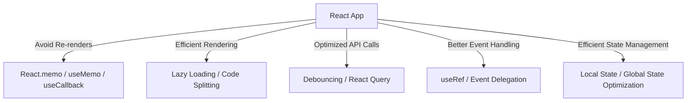

# **Performance Optimization in React**  

Performance optimization in React focuses on reducing unnecessary re-renders, improving component rendering speed, optimizing API calls, and ensuring efficient state management. Key strategies include memoization, lazy loading, code splitting, and optimizing event handling.

---

## **Key Performance Issues in React**  

| **Issue**                  | **Impact**                                         | **Solution** |
|----------------------------|---------------------------------------------------|--------------|
| **Unnecessary Re-renders** | Reduces app speed by rendering unchanged components | `React.memo`, `useMemo`, `useCallback` |
| **Expensive Computations** | Slows down UI updates due to repeated calculations | `useMemo` |
| **Frequent Function Creation** | Creates new function instances on each render | `useCallback` |
| **Large Component Trees** | Slows rendering due to deeply nested components | Code splitting, lazy loading |
| **Slow API Requests** | Blocks UI updates and increases load time | Caching, debouncing, React Query |

---

## **1. Preventing Unnecessary Re-renders**  

### **Using `React.memo()` for Functional Components**  
Prevents a component from re-rendering unless its props change.  

```jsx
import React from "react";

const ExpensiveComponent = React.memo(({ data }) => {
  console.log("Rendered");
  return <p>{data}</p>;
});
```  

✅ **Use when a component receives the same props frequently.**  
⚠ **Avoid when props change often.**  

---

### **Using `useMemo()` for Expensive Computations**  
Caches results of computations to avoid recalculations.  

```jsx
import { useMemo } from "react";

const ExpensiveCalculation = ({ num }) => {
  const result = useMemo(() => {
    console.log("Calculating...");
    return num * 2;
  }, [num]);

  return <p>Result: {result}</p>;
};
```  

✅ **Use for slow calculations that do not need recalculating often.**  

---

### **Using `useCallback()` to Prevent Function Recreation**  
Prevents child components from re-rendering due to function recreation.  

```jsx
import { useState, useCallback } from "react";

const Parent = () => {
  const [count, setCount] = useState(0);

  const handleClick = useCallback(() => {
    console.log("Button clicked");
  }, []);

  return <Child onClick={handleClick} />;
};

const Child = React.memo(({ onClick }) => <button onClick={onClick}>Click</button>);
```  

✅ **Use for passing stable functions to child components.**  

---

## **2. Optimizing Component Rendering**  

### **Lazy Loading Components (`React.lazy`)**  
Loads components only when needed, reducing the initial bundle size.  

```jsx
import React, { lazy, Suspense } from "react";

const HeavyComponent = lazy(() => import("./HeavyComponent"));

const App = () => (
  <Suspense fallback={<p>Loading...</p>}>
    <HeavyComponent />
  </Suspense>
);
```  

✅ **Reduces initial page load time.**  
⚠ **Requires error boundaries for handling failed imports.**  

---

### **Code Splitting Using React Router (`React.lazy + Suspense`)**  
Loads route-specific components only when the route is accessed.  

```jsx
import { BrowserRouter, Routes, Route } from "react-router-dom";
import { lazy, Suspense } from "react";

const Home = lazy(() => import("./Home"));
const About = lazy(() => import("./About"));

const App = () => (
  <BrowserRouter>
    <Suspense fallback={<p>Loading...</p>}>
      <Routes>
        <Route path="/" element={<Home />} />
        <Route path="/about" element={<About />} />
      </Routes>
    </Suspense>
  </BrowserRouter>
);
```  

✅ **Optimizes performance by reducing the initial JavaScript payload.**  

---

## **3. Optimizing API Calls**  

### **Debouncing API Requests (Delaying Frequent Calls)**  
Prevents API calls from triggering too frequently, reducing load.  

```jsx
import { useState } from "react";
import { debounce } from "lodash";

const Search = () => {
  const [query, setQuery] = useState("");

  const handleSearch = debounce((value) => {
    fetch(`https://api.example.com/search?q=${value}`);
  }, 300);

  return <input onChange={(e) => handleSearch(e.target.value)} />;
};
```  

✅ **Useful for search bars, live filtering, and auto-suggestions.**  

---

### **Using React Query for Caching API Calls**  
Automatically caches responses and reduces unnecessary re-fetching.  

```jsx
import { useQuery } from "react-query";
import axios from "axios";

const fetchData = async () => {
  const response = await axios.get("https://jsonplaceholder.typicode.com/posts");
  return response.data;
};

const DataComponent = () => {
  const { data, isLoading } = useQuery("posts", fetchData);

  return isLoading ? <p>Loading...</p> : <p>{data[0].title}</p>;
};
```  

✅ **Reduces repeated API calls, improving performance.**  

---

## **4. Optimizing Event Handling**  

### **Using `useRef` for Persistent Values**  
Avoids unnecessary re-renders when tracking values like form inputs.  

```jsx
import { useRef } from "react";

const InputExample = () => {
  const inputRef = useRef();

  return <input ref={inputRef} />;
};
```  

✅ **Improves performance for frequently accessed values.**  

---

### **Event Delegation (Using One Event Listener for Multiple Elements)**  
Instead of adding event listeners to each element, attach one listener to the parent.  

```jsx
const List = () => {
  const handleClick = (event) => console.log(event.target.textContent);

  return (
    <ul onClick={handleClick}>
      <li>Item 1</li>
      <li>Item 2</li>
      <li>Item 3</li>
    </ul>
  );
};
```  

✅ **Improves performance in lists and dynamically generated elements.**  

---

## **5. Avoiding Large State Updates**  

### **Using Local State Instead of Global State**  
Minimizes unnecessary re-renders by keeping state at the lowest possible level.  

```jsx
const Parent = () => {
  return <Child />;
};

const Child = () => {
  const [count, setCount] = useState(0);
  return <button onClick={() => setCount(count + 1)}>Click {count}</button>;
};
```  

✅ **Prevents entire component trees from re-rendering.**  

---

## **Performance Optimization Summary**  

| **Optimization** | **Technique** | **Usage** |
|-----------------|--------------|-----------|
| **Reducing Re-renders** | `React.memo`, `useMemo`, `useCallback` | Prevents unnecessary component updates |
| **Optimizing Rendering** | Lazy loading, code splitting | Loads components only when needed |
| **Optimizing API Calls** | React Query, debouncing | Reduces frequent API calls |
| **Efficient Event Handling** | `useRef`, event delegation | Minimizes re-renders and improves event efficiency |
| **Managing State Properly** | Use local state, avoid deep state updates | Reduces unnecessary component tree updates |

---

## **Diagram: React Performance Optimization Strategies**  



---

## **Conclusion**  

React performance optimization ensures a smooth and responsive UI by minimizing unnecessary re-renders, optimizing API calls, and handling events efficiently. Strategies like memoization, lazy loading, and proper state management significantly improve application speed and efficiency.