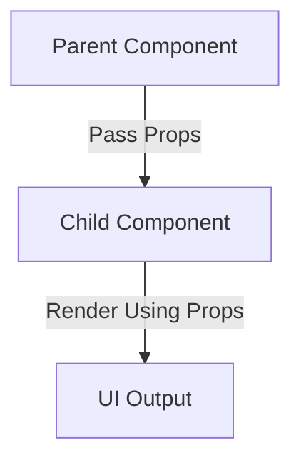

# **Props in React**  

## **Definition**  
**Props (short for "properties")** are **read-only data** passed from a **parent component** to a **child component** in React.  

- Props allow **component reusability** and **dynamic rendering.**  
- They are **immutable**, meaning a child component **cannot modify** its props.  

---

## **Passing Props to a Component**  

### **Example (Class Component)**  
```jsx
class Welcome extends React.Component {
  render() {
    return <h1>Hello, {this.props.name}!</h1>;
  }
}

function App() {
  return <Welcome name="Alice" />;
}
```
- The **parent (`App`)** passes `name="Alice"` as a prop to the **child (`Welcome`)**.  
- The child accesses the value using `this.props.name`.  

---

### **Example (Functional Component with Props)**  
```jsx
function Welcome(props) {
  return <h1>Hello, {props.name}!</h1>;
}

function App() {
  return <Welcome name="Alice" />;
}
```
- Functional components access props using **`props` as a function parameter**.  

---

## **Destructuring Props**  
Props can be **destructured** for cleaner code.  
```jsx
function Welcome({ name }) {
  return <h1>Hello, {name}!</h1>;
}
```
- Instead of `props.name`, we use `{ name }` directly.  

---

## **Default Props**  
Props can have **default values** using `defaultProps`.  

### **Example (Class Component)**  
```jsx
class Welcome extends React.Component {
  static defaultProps = {
    name: "Guest",
  };

  render() {
    return <h1>Hello, {this.props.name}!</h1>;
  }
}
```
### **Example (Functional Component with Default Props)**  
```jsx
function Welcome({ name = "Guest" }) {
  return <h1>Hello, {name}!</h1>;
}
```
- If `name` is not provided, it defaults to `"Guest"`.  

---

## **Passing Multiple Props**  
Props can pass multiple values, including **strings, numbers, booleans, arrays, and objects**.  

```jsx
function UserProfile({ name, age, hobbies }) {
  return (
    <div>
      <h1>{name}</h1>
      <p>Age: {age}</p>
      <p>Hobbies: {hobbies.join(", ")}</p>
    </div>
  );
}

function App() {
  return <UserProfile name="Alice" age={25} hobbies={["Reading", "Gaming"]} />;
}
```

---

## **Props with Functions (Event Handling)**  
Props can also pass functions for **event handling**.  

```jsx
function Button({ onClick }) {
  return <button onClick={onClick}>Click Me</button>;
}

function App() {
  const handleClick = () => alert("Button Clicked!");

  return <Button onClick={handleClick} />;
}
```
- The **parent (`App`) passes `handleClick` as a prop**.  
- The **child (`Button`) calls `onClick` when clicked**.  

---

## **Props with Children (`props.children`)**  
`props.children` allows passing **nested components** inside a component.  

```jsx
function Card({ children }) {
  return <div className="card">{children}</div>;
}

function App() {
  return (
    <Card>
      <h2>Title</h2>
      <p>Some content here.</p>
    </Card>
  );
}
```
- The `Card` component wraps **nested elements** using `props.children`.  

---

## **Diagram: How Props Work**  


---

## **Key Takeaways**  
- **Props pass data** from parent to child.  
- **They are read-only** and **cannot be modified** by the child.  
- **Used in both class and functional components.**  
- **Can pass multiple data types** (strings, numbers, arrays, objects, functions).  
- **`props.children`** allows **nested elements inside a component.**  
- **Default values** can be set using `defaultProps` or destructuring.

---
---

## React Props

#### Description
Props (short for "properties") are read-only attributes used to pass data from a parent component to a child component. They allow components to be dynamic and reusable by providing a way to customize their behavior and appearance.

### Key Parts of Props

1. **Passing Props**
2. **Accessing Props**
3. **Default Props**
4. **Prop Types**
5. **Props vs State**

### Detailed Note on Props

#### 1. Passing Props

**Description**: Props are passed to components similarly to how attributes are passed to HTML elements.

**Syntax**:
```jsx
<ChildComponent propName={propValue} />
```

**Purpose**: To provide data and configuration to child components.

**Example**:
```jsx
function App() {
  return <Greeting name="John" />;
}

function Greeting(props) {
  return <h1>Hello, {props.name}!</h1>;
}
```

#### 2. Accessing Props

**Description**: Props are accessed within a component using `this.props` in class components or directly as function arguments in functional components.

**Syntax (Class Component)**:
```jsx
class Greeting extends React.Component {
  render() {
    return <h1>Hello, {this.props.name}!</h1>;
  }
}
```

**Syntax (Functional Component)**:
```jsx
function Greeting(props) {
  return <h1>Hello, {props.name}!</h1>;
}
```

**Purpose**: To use the passed data within the component.

**Example**:
```jsx
function App() {
  return <Greeting name="John" />;
}

function Greeting(props) {
  return <h1>Hello, {props.name}!</h1>;
}
```

#### 3. Default Props

**Description**: Default props are used to ensure that a component has default values for its props if none are provided.

**Syntax**:
```jsx
Greeting.defaultProps = {
  name: 'Stranger'
};
```

**Purpose**: To provide default values for props.

**Example**:
```jsx
function Greeting(props) {
  return <h1>Hello, {props.name}!</h1>;
}

Greeting.defaultProps = {
  name: 'Stranger'
};
```

#### 4. Prop Types

**Description**: Prop types are used to enforce type checking on props, ensuring that the correct type of data is passed to a component.

**Syntax**:
```jsx
import PropTypes from 'prop-types';

Greeting.propTypes = {
  name: PropTypes.string
};
```

**Purpose**: To validate the types of props passed to a component.

**Example**:
```jsx
import PropTypes from 'prop-types';

function Greeting(props) {
  return <h1>Hello, {props.name}!</h1>;
}

Greeting.propTypes = {
  name: PropTypes.string
};
```

#### 5. Props vs State

**Description**: Props and state are both used to manage data in React components, but they serve different purposes.

**Props**:
- Passed from parent to child components.
- Immutable within the child component.
- Used to configure and customize components.

**State**:
- Managed within the component.
- Mutable and can change over time.
- Used to manage dynamic data and control component behavior.

**Example**:
```jsx
class ParentComponent extends React.Component {
  constructor(props) {
    super(props);
    this.state = { count: 0 };
  }

  render() {
    return <ChildComponent count={this.state.count} />;
  }
}

function ChildComponent(props) {
  return <h1>Count: {props.count}</h1>;
}
```

### Summary
Props are a fundamental concept in React that allow components to receive data and configuration from their parent components. They are read-only and help make components reusable and dynamic. Understanding how to pass, access, and validate props, as well as the difference between props and state, is crucial for building robust React applications.