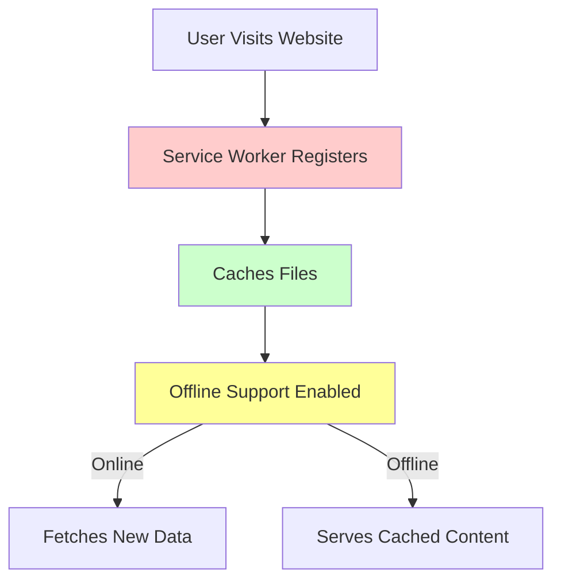

# **Progressive Web Apps (PWAs) in React**

## **Definition**  
A **Progressive Web App (PWA)** is a web application that offers a **native app-like experience** using modern web capabilities such as offline access, push notifications, and fast loading speeds. PWAs in React can be built using **service workers** and **manifest files** to enhance user experience.

---

## **Key Features of PWAs**
| Feature | Description |
|---------|------------|
| **Offline Support** | Uses **service workers** to cache resources, allowing access without an internet connection. |
| **Fast Performance** | Loads quickly by caching assets and serving them efficiently. |
| **Installable** | Users can **install** the app on their device like a native app. |
| **Responsive** | Works on all screen sizes and devices. |
| **Secure** | Requires **HTTPS** for security and integrity. |
| **Push Notifications** | Allows **engaging notifications** like native apps. |

---

## **1. Setting Up a PWA in React**
React provides built-in support for PWAs using **Create React App (CRA)**.

### **Steps to Convert a React App into a PWA**
1. **Create a React App**  
   ```bash
   npx create-react-app my-pwa-app
   cd my-pwa-app
   ```

2. **Enable Service Worker**  
   In `src/index.js`, modify the service worker registration:
   ```jsx
   import React from "react";
   import ReactDOM from "react-dom";
   import App from "./App";
   import * as serviceWorkerRegistration from "./serviceWorkerRegistration";

   ReactDOM.render(<App />, document.getElementById("root"));

   // Register service worker for PWA features
   serviceWorkerRegistration.register();
   ```

3. **Update `manifest.json` (Web App Manifest)**
   Located in `public/manifest.json`, it defines how the app behaves when installed:
   ```json
   {
     "short_name": "MyPWA",
     "name": "My Progressive Web App",
     "icons": [
       {
         "src": "icon-192x192.png",
         "type": "image/png",
         "sizes": "192x192"
       },
       {
         "src": "icon-512x512.png",
         "type": "image/png",
         "sizes": "512x512"
       }
     ],
     "start_url": "/",
     "display": "standalone",
     "theme_color": "#000000",
     "background_color": "#ffffff"
   }
   ```

4. **Serve Over HTTPS**  
   PWAs require HTTPS for service workers. Deploy using **Netlify, Vercel, or Firebase Hosting** for secure hosting.

---

## **2. Understanding Service Workers**
A **service worker** is a JavaScript file that runs in the background, handling **caching, push notifications, and offline capabilities**.

### **Basic Service Worker (`src/service-worker.js`)**
```js
self.addEventListener("install", (event) => {
  event.waitUntil(
    caches.open("pwa-cache").then((cache) => {
      return cache.addAll(["/", "/index.html", "/static/js/bundle.js"]);
    })
  );
});

self.addEventListener("fetch", (event) => {
  event.respondWith(
    caches.match(event.request).then((response) => {
      return response || fetch(event.request);
    })
  );
});
```

✅ **Registers cache and serves content offline.**  

---

## **3. PWA Lifecycle**


---

## **4. Testing a PWA in Chrome**
1. Open **DevTools (`F12`)** → **Application Tab**  
2. Check **Manifest & Service Workers**  
3. Toggle **Offline Mode** in Network Tab  
4. Verify PWA behavior  

---

## **5. Deploying a PWA**
Popular hosting options:  
- **Vercel** (`vercel deploy`)  
- **Netlify** (`netlify deploy`)  
- **Firebase Hosting** (`firebase deploy`)  

---

## **6. Benefits of PWAs**
| Benefit | Description |
|---------|------------|
| **Better Performance** | Faster load times with cached assets |
| **Offline Support** | Works without an internet connection |
| **App-Like Feel** | Installable like a mobile app |
| **SEO-Friendly** | Indexed by search engines |
| **No App Store Approval** | No need for Play Store or App Store |

---

## **Conclusion**
- **PWAs enhance user experience** by making web apps **fast, installable, and offline-capable**.  
- **React with service workers** enables smooth integration for caching and performance.  
- **Best for e-commerce, blogs, and productivity apps** needing offline support. 🚀