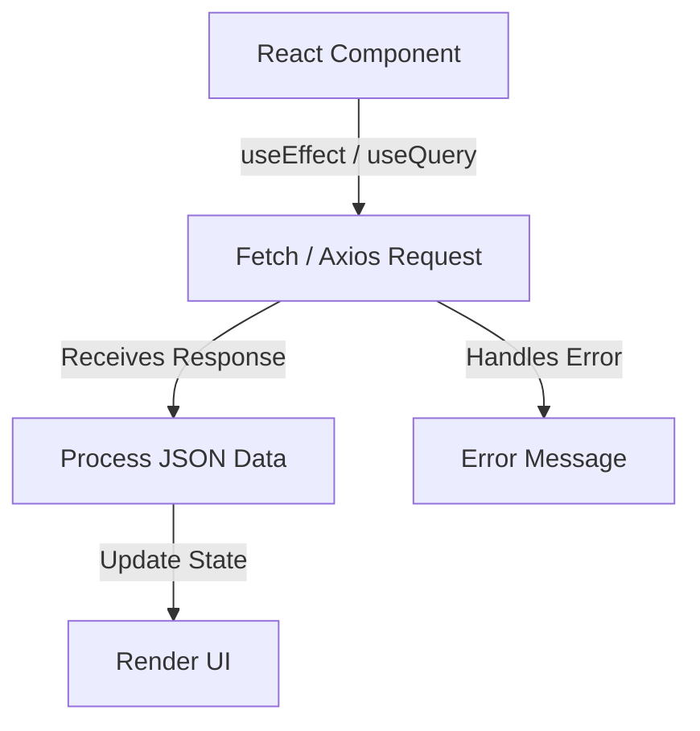

## **React and APIs**  

APIs (Application Programming Interfaces) allow React applications to fetch, send, and manipulate data from external sources such as RESTful services or GraphQL endpoints. React interacts with APIs using `fetch`, `axios`, or built-in hooks like `useEffect` and `useState`.  

---

### **Types of APIs in React**  

| **API Type**       | **Description** | **Example** |
|------------------|----------------|-------------|
| **REST API** | Uses HTTP methods (GET, POST, PUT, DELETE) to perform operations. | `fetch("https://api.example.com/data")` |
| **GraphQL API** | Fetches specific data using queries instead of multiple endpoints. | `query { user(id:1) { name } }` |
| **WebSockets** | Real-time, bidirectional communication between server and client. | `new WebSocket("ws://example.com")` |
| **Local API (JSON Server, Firebase, etc.)** | Used for testing or backend services. | `fetch("http://localhost:3000/data")` |

---

### **Fetching Data in React**  

#### **1. Using `fetch` API** (Built-in JavaScript Method)  
```jsx
import { useEffect, useState } from "react";

const FetchExample = () => {
  const [data, setData] = useState([]);

  useEffect(() => {
    fetch("https://jsonplaceholder.typicode.com/posts")
      .then((response) => response.json())
      .then((json) => setData(json))
      .catch((error) => console.error("Error fetching data:", error));
  }, []);

  return <div>{data.length > 0 ? <p>{data[0].title}</p> : "Loading..."}</div>;
};

export default FetchExample;
```  

✅ **Pros:** Native, lightweight  
⚠ **Cons:** No built-in error handling or timeout control  

---

#### **2. Using Axios (Third-party Library for Simpler Requests)**  
```jsx
import { useEffect, useState } from "react";
import axios from "axios";

const AxiosExample = () => {
  const [data, setData] = useState([]);

  useEffect(() => {
    axios
      .get("https://jsonplaceholder.typicode.com/posts")
      .then((response) => setData(response.data))
      .catch((error) => console.error("Error fetching data:", error));
  }, []);

  return <div>{data.length > 0 ? <p>{data[0].title}</p> : "Loading..."}</div>;
};

export default AxiosExample;
```  

✅ **Pros:** Handles errors, supports request cancelation, works with Promises  
⚠ **Cons:** Requires an external dependency  

---

### **Sending Data (POST Request Example)**  

#### **1. Using `fetch`**
```jsx
const postData = async () => {
  const response = await fetch("https://jsonplaceholder.typicode.com/posts", {
    method: "POST",
    headers: { "Content-Type": "application/json" },
    body: JSON.stringify({ title: "New Post", body: "Content here" }),
  });
  const data = await response.json();
  console.log(data);
};
```  

#### **2. Using Axios**
```jsx
const postData = async () => {
  const response = await axios.post("https://jsonplaceholder.typicode.com/posts", {
    title: "New Post",
    body: "Content here",
  });
  console.log(response.data);
};
```  

---

### **Handling API Errors**  

- **Try-Catch Blocks** (for async functions)  
- **`.catch()` method** (for promises)  
- **Status Code Checking** (e.g., `if(response.status === 200)`)  

Example:  
```jsx
try {
  const response = await fetch("https://api.example.com/data");
  if (!response.ok) throw new Error("Network response was not ok");
  const data = await response.json();
} catch (error) {
  console.error("Fetch error:", error);
}
```  

---

### **Optimizing API Calls**  

| **Optimization** | **Solution** |
|----------------|--------------|
| **Debouncing API Calls** | Use `setTimeout` or external libraries like Lodash (`_.debounce()`) to limit frequent calls. |
| **Caching Responses** | Store fetched data using `useState` or libraries like React Query. |
| **Pagination & Lazy Loading** | Fetch data in chunks instead of loading everything at once. |
| **Abort Requests** | Use `AbortController` to cancel API calls when components unmount. |

Example of **aborting API requests**:  
```jsx
useEffect(() => {
  const controller = new AbortController();
  fetch("https://api.example.com/data", { signal: controller.signal });

  return () => controller.abort();
}, []);
```  

---

### **Using React Query for API Calls**  

React Query provides automatic caching, background updates, and performance optimizations.  
```jsx
import { useQuery } from "react-query";
import axios from "axios";

const fetchPosts = () => axios.get("https://jsonplaceholder.typicode.com/posts").then(res => res.data);

const Posts = () => {
  const { data, error, isLoading } = useQuery("posts", fetchPosts);

  if (isLoading) return <p>Loading...</p>;
  if (error) return <p>Error fetching data</p>;

  return <div>{data.map(post => <p key={post.id}>{post.title}</p>)}</div>;
};
```  

✅ **Pros:** Automatic caching, background updates, reduced re-fetching  
⚠ **Cons:** Adds a dependency, requires a provider (`QueryClientProvider`)  

---

### **Diagram: API Call Flow in React**  



---

### **When to Use Which API Method?**  

| **Use Case**          | **Best Method** |
|----------------------|---------------|
| Simple requests (GET) | `fetch` or `useQuery` |
| Complex requests (POST, PUT, DELETE) | `axios` |
| Real-time updates | WebSockets |
| Optimized API calls | React Query |
| Prevent unnecessary calls | Debouncing, caching |

---

### **Conclusion**  

React interacts with APIs using `fetch`, `axios`, or libraries like React Query. Choose the right method based on the use case, optimize calls to improve performance, and handle errors to ensure a smooth user experience. 