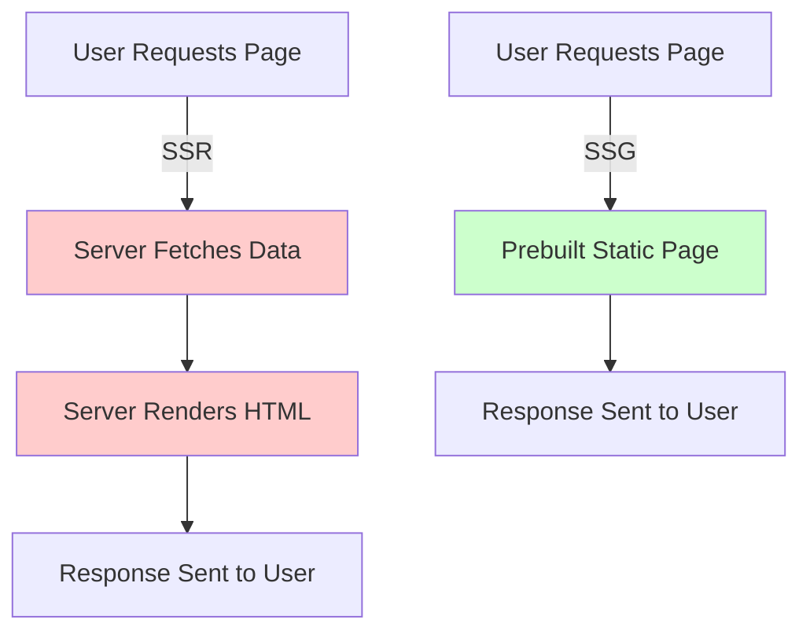

# **SSR (Server-Side Rendering) and SSG (Static Site Generation) in React**

## **Definition**
SSR (Server-Side Rendering) and SSG (Static Site Generation) are two rendering strategies used in React frameworks like **Next.js** to optimize performance and SEO.  

- **SSR (Server-Side Rendering)**: Renders pages on the server **at request time**, generating fresh content dynamically.  
- **SSG (Static Site Generation)**: Pre-renders pages **at build time**, serving static files for fast performance.  

---

## **Comparison: SSR vs. SSG**

| Feature | **SSR (Server-Side Rendering)** | **SSG (Static Site Generation)** |
|---------|---------------------------------|----------------------------------|
| **Rendering Time** | At the time of request | At build time |
| **Performance** | Slightly slower (server processing per request) | Faster (pre-generated static files) |
| **SEO** | Good, since the full HTML is served to search engines | Best, as the content is fully static |
| **Use Case** | Dynamic content (e.g., user-specific dashboards) | Static content (e.g., blogs, landing pages) |
| **Data Fetching** | Runs on every request (`getServerSideProps`) | Runs at build time (`getStaticProps`) |
| **Caching** | Can be cached but needs revalidation | Fully cacheable on CDNs |
| **Scalability** | Depends on server load | Highly scalable with CDNs |

---

## **1. Server-Side Rendering (SSR)**  
SSR **fetches data and renders HTML on the server** before sending it to the browser.

### **Usage**
- **Personalized pages** (e.g., user dashboards)  
- **Rapid updates** (e.g., live data from APIs)  
- **SEO optimization for dynamic content**  

### **Implementation in Next.js (SSR)**
```jsx
export async function getServerSideProps(context) {
  const res = await fetch("https://api.example.com/data");
  const data = await res.json();

  return { props: { data } };
}

const Page = ({ data }) => <div>{data.message}</div>;

export default Page;
```
✅ Runs on **every request** and fetches fresh data.  

---

## **2. Static Site Generation (SSG)**  
SSG **pre-renders pages at build time**, serving fast static HTML.

### **Usage**
- **Blogs, documentation, marketing pages**  
- **Pages that don’t change often**  

### **Implementation in Next.js (SSG)**
```jsx
export async function getStaticProps() {
  const res = await fetch("https://api.example.com/data");
  const data = await res.json();

  return { props: { data } };
}

const Page = ({ data }) => <div>{data.message}</div>;

export default Page;
```
✅ Generates static files, making it **fast and cache-friendly**.  

---

## **Diagram: SSR vs. SSG**


---

## **Choosing Between SSR and SSG**
| **When to Use SSR** | **When to Use SSG** |
|--------------------|--------------------|
| Frequently changing data | Static, rarely updated content |
| Personalized user data | Blog posts, documentation |
| Real-time updates required | Marketing and landing pages |
| Cannot prebuild at deployment | Pre-rendering improves performance |

✅ **Hybrid Approach**: **Incremental Static Regeneration (ISR)** in Next.js allows static pages to update **without rebuilding the entire site**.

---

## **Conclusion**
- **SSR** ensures **fresh, dynamic content** but adds **server load**.  
- **SSG** is **faster and more scalable** but works best for **static content**.  
- **Choose based on project needs**—SSR for real-time updates, SSG for speed. 🚀