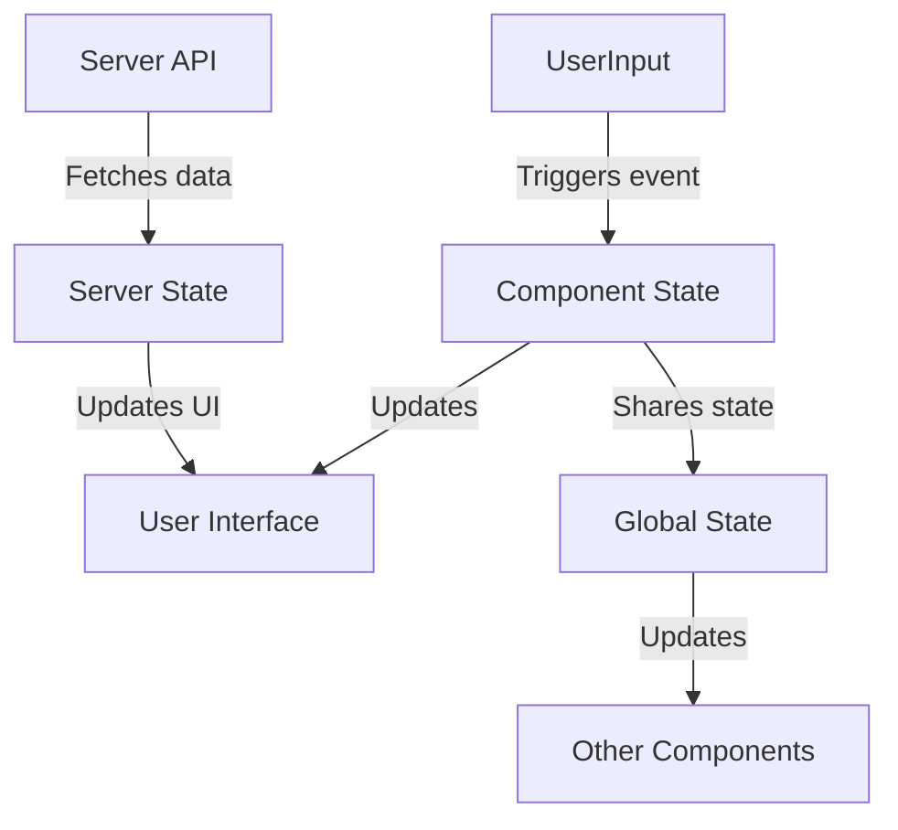

## **State Management in React**  

State management in React is crucial for handling data and UI updates efficiently. React provides multiple ways to manage state, ranging from **component-level state** to **global state management**.  

---

### **Types of State in React**  
State in React can be categorized into:  

- **Local State** – Managed within a single component (e.g., `useState`).  
- **Global State** – Shared across multiple components (e.g., `useContext`, Redux).  
- **Derived State** – Computed from existing state rather than stored separately.  
- **Server State** – Fetched from an API and synchronized with the UI (e.g., React Query).  
- **URL State** – State that exists in the URL parameters or query strings (e.g., React Router).  

---

### **Built-in State Management Hooks**  

| **Hook**       | **Description** | **Usage** |  
|---------------|---------------|-----------|  
| `useState` | Manages local component state | `const [count, setCount] = useState(0);` |  
| `useReducer` | Manages complex state logic | `const [state, dispatch] = useReducer(reducer, initialState);` |  
| `useContext` | Shares global state between components | `const value = useContext(MyContext);` |  

---

### **Global State Management Solutions**  

| **Library**    | **Pros** | **Cons** | **Best For** |  
|---------------|---------|---------|-------------|  
| **Context API** | Built-in, lightweight, easy to use | Re-renders entire tree if not optimized | Small-scale apps, sharing state between a few components |  
| **Redux** | Predictable, scalable, great for debugging | Boilerplate-heavy, requires setup | Large applications with complex state logic |  
| **Zustand** | Minimal API, fast, easy to use | Less popular than Redux | Simple state management with minimal setup |  
| **Recoil** | React-friendly, easy to adopt | Still experimental | Apps needing flexible state handling |  
| **Jotai** | Atom-based, minimal boilerplate | Newer library, smaller ecosystem | Fine-grained state updates without global re-renders |  

---

### **When to Use What?**  

- **Component-Level State (`useState`, `useReducer`)** → When only one component needs the state.  
- **Context API (`useContext`)** → When multiple components need access to shared state.  
- **Redux/Zustand/Recoil/Jotai** → When managing complex state across the entire application.  

---

### **Diagram: State Management Flow**  

---

### **Conclusion**  
Choosing the right state management approach depends on your app’s complexity. **For small apps, React’s built-in hooks are enough**. **For large-scale apps, solutions like Redux or Zustand provide better scalability**.