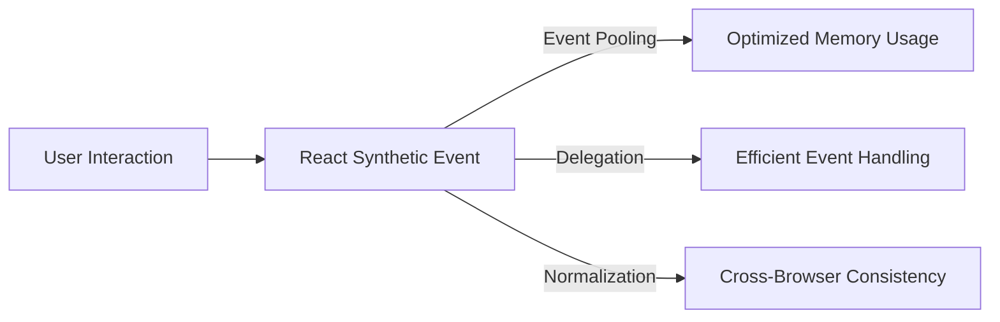

# **Synthetic Events in React**  

## **Definition**  
A **Synthetic Event** in React is a **wrapper around the native DOM event** that normalizes event behavior across different browsers. It is part of React’s event system and ensures consistent event properties regardless of the browser.  

React **pools** synthetic events for performance, meaning events are reused and not available asynchronously.  

---

## **Why Use Synthetic Events?**  
- **Cross-Browser Compatibility**: Ensures uniform behavior across all browsers.  
- **Performance Optimization**: Uses event pooling to reduce memory usage.  
- **Event Delegation**: Attaches events to the root rather than individual elements for efficiency.  

---

## **Handling Synthetic Events**  
Synthetic events are handled just like regular DOM events but work consistently across all browsers.  

### **Example: Button Click Event**  
```jsx
function App() {
  function handleClick(event) {
    console.log(event); // Synthetic event
    alert("Button clicked!");
  }

  return <button onClick={handleClick}>Click Me</button>;
}
```
- The `event` passed is a **SyntheticEvent**, not a native event.  

---

## **Synthetic Event Properties**  
Synthetic Events **mirror** native events and have the same properties.  

| Property           | Description |
|--------------------|-------------|
| `type`            | Type of event (e.g., `"click"`, `"change"`) |
| `target`          | DOM element that triggered the event |
| `currentTarget`   | Element currently handling the event |
| `nativeEvent`     | Original native event |
| `bubbles`         | Indicates if event bubbles up |
| `preventDefault()` | Prevents default behavior |
| `stopPropagation()` | Stops event bubbling |

---

## **Event Pooling in React**  
React **pools** synthetic events for performance, meaning the same event object is **reused** across multiple events.  

### **Example: Event Becomes Null After Async Call**
```jsx
function App() {
  function handleClick(event) {
    console.log(event.type); // "click"
    
    setTimeout(() => {
      console.log(event.type); // Will be null due to event pooling
    }, 1000);
  }

  return <button onClick={handleClick}>Click Me</button>;
}
```
- The event object **is nullified** after the function execution ends.  

### **Solution: Store the Event Before Async Calls**
```jsx
function App() {
  function handleClick(event) {
    let eventType = event.type; // Store event property

    setTimeout(() => {
      console.log(eventType); // Still accessible
    }, 1000);
  }

  return <button onClick={handleClick}>Click Me</button>;
}
```
- Storing event properties **prevents loss due to pooling**.  

---

## **Preventing Default Behavior**  
Use `event.preventDefault()` to **stop default actions** like form submission or link navigation.  

```jsx
function Form() {
  function handleSubmit(event) {
    event.preventDefault();
    alert("Form submitted!");
  }

  return (
    <form onSubmit={handleSubmit}>
      <button type="submit">Submit</button>
    </form>
  );
}
```
- **Form does not reload the page** when submitted.  

---

## **Stopping Event Propagation**  
Use `event.stopPropagation()` to **prevent event bubbling**.  

```jsx
function App() {
  function handleOuterClick() {
    alert("Outer div clicked!");
  }

  function handleInnerClick(event) {
    event.stopPropagation(); // Stops bubbling
    alert("Inner button clicked!");
  }

  return (
    <div onClick={handleOuterClick}>
      <button onClick={handleInnerClick}>Click Me</button>
    </div>
  );
}
```
- Clicking the **button** does not trigger the outer div's event.  

---

## **Diagram: Synthetic Event Flow in React**  


---

## **Key Takeaways**  
- **Synthetic Events** wrap native events for consistency across browsers.  
- **Event Pooling** improves performance but makes events unavailable asynchronously.  
- Use **`preventDefault()`** to stop default behavior.  
- Use **`stopPropagation()`** to prevent event bubbling.  
- Store event properties before async calls to avoid losing data.