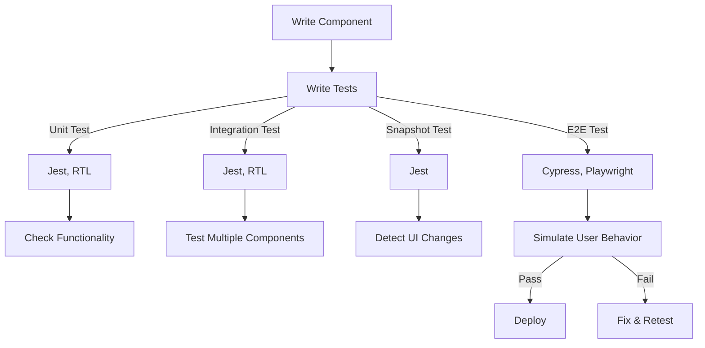

# **Testing in React**

## **Definition**
Testing in React ensures that components and applications function as expected by verifying their behavior under different conditions. It helps catch bugs early, improves maintainability, and ensures a stable user experience.

---

## **Types of Testing in React**
| **Type**            | **Purpose** | **Tools Used** |
|---------------------|------------|---------------|
| **Unit Testing**   | Tests individual functions or components in isolation. | Jest, React Testing Library |
| **Integration Testing** | Ensures multiple components work together correctly. | Jest, React Testing Library |
| **End-to-End (E2E) Testing** | Simulates user interactions to test the full application flow. | Cypress, Playwright, Selenium |
| **Snapshot Testing** | Captures UI output and compares it to previous versions to detect unintended changes. | Jest, React Testing Library |

---

## **1. Unit Testing in React**
Unit tests **verify the correctness of individual components or functions**.

### **Example: Testing a Function**
```jsx
// sum.js
export const sum = (a, b) => a + b;
```
```jsx
// sum.test.js
import { sum } from "./sum";

test("adds 2 + 3 to equal 5", () => {
  expect(sum(2, 3)).toBe(5);
});
```
✅ Ensures that small logic blocks work correctly.  

---

## **2. Component Testing using Jest and React Testing Library**
Jest is a popular testing framework, and **React Testing Library (RTL)** helps test components by simulating user interactions.

### **Example: Testing a React Component**
```jsx
// Button.js
import React from "react";

const Button = ({ onClick, label }) => (
  <button onClick={onClick}>{label}</button>
);

export default Button;
```
```jsx
// Button.test.js
import { render, screen, fireEvent } from "@testing-library/react";
import Button from "./Button";

test("renders button with label", () => {
  render(<Button label="Click Me" />);
  expect(screen.getByText("Click Me")).toBeInTheDocument();
});

test("calls function on click", () => {
  const handleClick = jest.fn();
  render(<Button label="Click Me" onClick={handleClick} />);
  fireEvent.click(screen.getByText("Click Me"));
  expect(handleClick).toHaveBeenCalledTimes(1);
});
```
✅ Tests UI rendering and user interactions.

---

## **3. Integration Testing**
Integration tests ensure multiple components work together as expected.

### **Example: Testing Form Submission**
```jsx
// Form.js
import { useState } from "react";

const Form = ({ onSubmit }) => {
  const [text, setText] = useState("");

  return (
    <form onSubmit={(e) => { e.preventDefault(); onSubmit(text); }}>
      <input value={text} onChange={(e) => setText(e.target.value)} />
      <button type="submit">Submit</button>
    </form>
  );
};

export default Form;
```
```jsx
// Form.test.js
import { render, screen, fireEvent } from "@testing-library/react";
import Form from "./Form";

test("submits form with correct input", () => {
  const handleSubmit = jest.fn();
  render(<Form onSubmit={handleSubmit} />);
  
  fireEvent.change(screen.getByRole("textbox"), { target: { value: "React" } });
  fireEvent.click(screen.getByText("Submit"));

  expect(handleSubmit).toHaveBeenCalledWith("React");
});
```
✅ Ensures different components (input, button) work together.

---

## **4. End-to-End (E2E) Testing with Cypress**
E2E testing **simulates real user interactions** on the application.

### **Example: Cypress Test for a Login Page**
```javascript
describe("Login Test", () => {
  it("logs in successfully", () => {
    cy.visit("/login");
    cy.get("input[name='email']").type("test@example.com");
    cy.get("input[name='password']").type("password123");
    cy.get("button[type='submit']").click();
    cy.url().should("include", "/dashboard");
  });
});
```
✅ Simulates real-world user experience.

---

## **5. Snapshot Testing**
Snapshot testing detects **unexpected UI changes**.

### **Example: Snapshot Test**
```jsx
import { render } from "@testing-library/react";
import Button from "./Button";

test("matches snapshot", () => {
  const { asFragment } = render(<Button label="Click Me" />);
  expect(asFragment()).toMatchSnapshot();
});
```
✅ Useful for catching unintended UI changes.

---

## **Diagram: React Testing Workflow**


---

## **Best Practices**
✅ Use **descriptive test cases** for readability.  
✅ Mock **API calls** to avoid real network requests.  
✅ Ensure **tests run independently** (avoid state dependencies).  
✅ Aim for **80%+ test coverage**, but **prioritize critical features**.  
✅ Run tests **automatically in CI/CD pipelines** (GitHub Actions, Jenkins).  

---

## **Conclusion**
Testing in React ensures **component reliability, prevents regressions, and improves application stability**. Unit, integration, E2E, and snapshot testing together create a **robust testing strategy**.