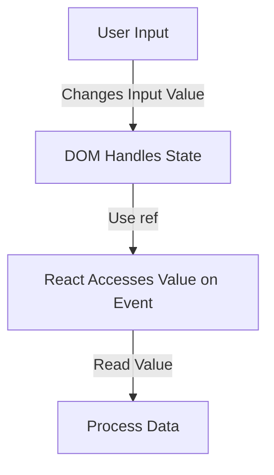

# **Uncontrolled Components in React**  

## **Definition**  
Uncontrolled components are form elements that manage their own state internally instead of being controlled by React state. The data is accessed using `ref` instead of `useState`.  

---

## **How Uncontrolled Components Work**  

- The browser handles the input state.  
- React accesses the input value using `ref`.  
- No need for `onChange` to update state.  

---

## **Basic Example**  

```jsx
import { useRef } from "react";

function UncontrolledInput() {
  const inputRef = useRef();

  function handleSubmit() {
    alert("Input Value: " + inputRef.current.value);
  }

  return (
    <>
      <input type="text" ref={inputRef} />
      <button onClick={handleSubmit}>Submit</button>
    </>
  );
}
```
✅ **Pros**: Simpler for non-interactive forms.  
❌ **Cons**: Harder to track and validate input changes.  

---

## **Accessing Values in Uncontrolled Components**  

### **File Input Example**  
```jsx
function FileUpload() {
  const fileRef = useRef();

  function handleUpload() {
    console.log("Selected File:", fileRef.current.files[0]);
  }

  return (
    <>
      <input type="file" ref={fileRef} />
      <button onClick={handleUpload}>Upload</button>
    </>
  );
}
```

### **Checkbox Example**  
```jsx
function UncontrolledCheckbox() {
  const checkboxRef = useRef();

  function handleSubmit() {
    alert("Checked: " + checkboxRef.current.checked);
  }

  return (
    <>
      <input type="checkbox" ref={checkboxRef} />
      <button onClick={handleSubmit}>Submit</button>
    </>
  );
}
```

---

## **Diagram: Uncontrolled Component Flow**  



---

## **Key Takeaways**  
- The browser manages the input value.  
- React accesses values using `ref`.  
- Ideal for file inputs and legacy forms.  
- Harder to validate compared to controlled components.