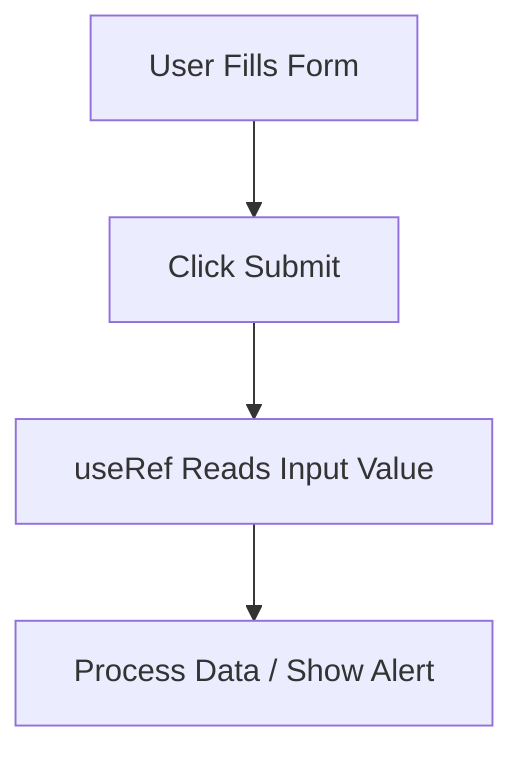

# **Using `useRef` in Forms**  

## **Definition**  
`useRef` allows direct access to form elements without re-rendering the component. It is mainly used in **uncontrolled components** where form inputs are not controlled by state.  

---

## **Why Use `useRef` in Forms?**  
✅ Avoids unnecessary re-renders.  
✅ Useful for focusing input fields.  
✅ Efficient for simple form submissions.  

❌ Cannot track input changes in real-time like `useState`.  

---

## **Basic Example: Uncontrolled Form Submission with `useRef`**  

```jsx
import { useRef } from "react";

function UncontrolledForm() {
  const nameRef = useRef();

  function handleSubmit(event) {
    event.preventDefault();
    alert("Submitted Name: " + nameRef.current.value);
  }

  return (
    <form onSubmit={handleSubmit}>
      <input type="text" ref={nameRef} placeholder="Enter name" />
      <button type="submit">Submit</button>
    </form>
  );
}
```

🔹 `nameRef.current.value` retrieves the input value.  

---

## **Example: Auto-Focusing an Input Field**  

```jsx
import { useRef, useEffect } from "react";

function AutofocusInput() {
  const inputRef = useRef();

  useEffect(() => {
    inputRef.current.focus();
  }, []);

  return <input ref={inputRef} placeholder="Auto-focused Input" />;
}
```

🔹 `useEffect` ensures the input is focused when the component mounts.  

---

## **Example: Handling Multiple Inputs with `useRef`**  

```jsx
function MultiInputForm() {
  const nameRef = useRef();
  const emailRef = useRef();

  function handleSubmit(event) {
    event.preventDefault();
    alert(`Name: ${nameRef.current.value}, Email: ${emailRef.current.value}`);
  }

  return (
    <form onSubmit={handleSubmit}>
      <input type="text" ref={nameRef} placeholder="Name" />
      <input type="email" ref={emailRef} placeholder="Email" />
      <button type="submit">Submit</button>
    </form>
  );
}
```

🔹 Each input has its own `useRef`, accessed separately.  

---

## **Comparison: `useRef` vs `useState` in Forms**  

| Feature         | `useRef` (Uncontrolled) | `useState` (Controlled) |
|---------------|----------------------|----------------------|
| Tracks changes? | ❌ No                 | ✅ Yes |
| Causes re-renders? | ❌ No | ✅ Yes |
| Best for? | Simple, direct access | Real-time input updates |
| Example use case | Auto-focus, handling file uploads | Form validation, dynamic changes |

---

## **Diagram: `useRef` in Form Handling**  



---

## **Key Takeaways**  
- `useRef` is useful for **reading input values** without causing re-renders.  
- Best for **uncontrolled components**, auto-focusing, and **accessing DOM elements**.  
- If real-time updates are needed, **use `useState` instead**.